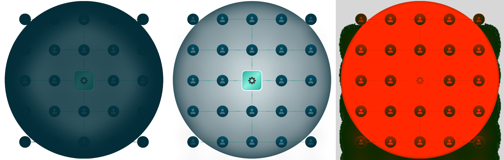
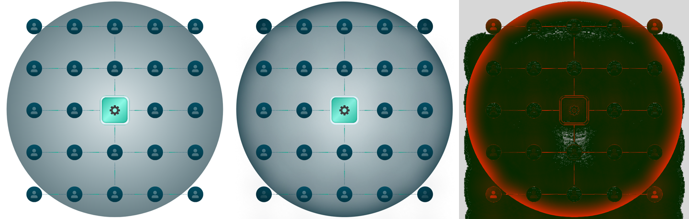

# Отчёт 2.2 — SVG из Figma в браузере против эталона (Queue Manager)

**Дата:** 2026-10-06 · **Файл:** `animations/queue-manager/source/figma-export.svg` (не изменялся)
**Как проверяли:** Chromium (Playwright), попиксельное сравнение `qa/svg-compare.mjs`, замер кадров `qa/svg-perf.mjs`.
Эксперименты с правками делались только на временных копиях вне репозитория.

## Эталон
- `figma-reference@1x.png` (Figma MCP) **не годится**: это скриншот холста, прозрачный фон в нём залит серым
  `#444444`, поэтому любое сравнение даёт 100 % расхождение по фону. Использовать его как эталон нельзя.
- Рабочий эталон — `figma-reference@2x.webp` (экспорт команды, 959×918). Он пересжат с потерями, поэтому
  небольшой шум (разница до ~8 из 255) — норма для этого сравнения.

## Результат

| Вариант SVG | Средняя разница | Пикселей с разницей > 8 | > 32 | Кадров/с при анимации |
|---|---|---|---|---|
| как есть из Figma | 75.1 | 85.5 % | 77.1 % | **~7** |
| без тени на корневом фрейме | **8.2** | 24.1 % | **8.1 %** | 60 |
| без всех 76 фильтров | — | — | — | 60 |

## Расхождения и объяснения

### 1. Тень на корневом фрейме — главное расхождение и главный тормоз
У фрейма `Queue Manager` в Figma есть внутренняя тень (radius 52, blur 23, цвет `#032e39`). Figma экспортирует её
фильтром, который строит тень от **прозрачности содержимого**. В браузере это затемняет всё внутри круга: аватары,
линии и карточка почти пропадают (левая картинка на первом изображении). Сама Figma рисует эту тень иначе:
тёмный ободок по краю круга, а центр и аватары остаются светлыми.
- **Проверено:** без этой одной тени средняя разница падает с 75 до 8.
- **Производительность:** с этой тенью анимация идёт ~7 кадров/с (фильтр на весь фрейм пересчитывается на каждом
  кадре движения импульсов). Без неё — 60 кадров/с. Остальные 75 фильтров (тени аватаров, карточки, gear) на
  замер не повлияли.
- **Повторить Figma один в один пока не удалось:** две пробные замены фильтра (тень от формы фрейма; тень от формы
  содержимого) дали 8.3 и 37 — не лучше, чем просто без тени. Как правильно передать ободок — вопрос к 2.3.

### 2. Остаток после удаления тени (8 % пикселей)
- **Ободок по краю круга** — это и есть эффект тени из п. 1, которой теперь нет.
- **Тонкие контуры карточки, линий и аватаров** — сглаживание краёв и шум сжатия WebP; на глаз не видно.
- Цвета, положение и размеры всех элементов совпадают — смещений нет.

### 3. Что совпадает полностью
Свечение (радиальный градиент), 24 аватара с тенями, пунктирные линии, импульсы с градиентами, карточка с внутренними
тенями и gear. Текста, масок и картинок нет — шрифты и растровые ресурсы не нужны.

## Оговорки
- Замер кадров — headless Chromium без GPU. На реальных устройствах цифры другие, но разница «7 против 60» —
  надёжный сигнал. Проверка на телефоне — в фазе 6 и QA (фаза 9).
- Замедление CPU в 4 раза на результат не повлияло: узкое место — растеризация фильтра, а не скрипт.

## Вопросы для 2.3 (правила подготовки SVG)
1. **Тень корневого фрейма:** (а) убрать из SVG и нарисовать ободок отдельным элементом (например, радиальный
   градиент или кольцо поверх свечения); (б) попросить дизайнера перенести тень с фрейма на сам круг `Ellipse 74`;
   (в) оставить статичной картинкой под анимируемым слоем.
2. Трансформы на импульсах, конфликт id на странице, лишние id — из отчёта 2.1.
